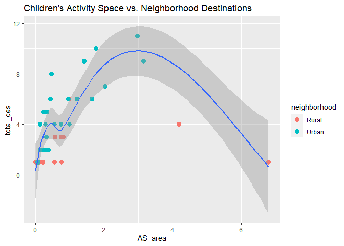
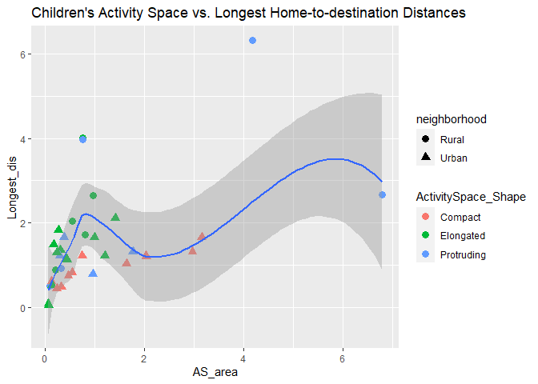

Exit\_project
================
Chunan Gao
4/13/2021

``` r
library(tidyverse)
```

    ## -- Attaching packages --------------------------------------- tidyverse 1.3.0 --

    ## v ggplot2 3.3.3     v purrr   0.3.4
    ## v tibble  3.0.6     v dplyr   1.0.3
    ## v tidyr   1.1.2     v stringr 1.4.0
    ## v readr   1.4.0     v forcats 0.5.1

    ## -- Conflicts ------------------------------------------ tidyverse_conflicts() --
    ## x dplyr::filter() masks stats::filter()
    ## x dplyr::lag()    masks stats::lag()

``` r
Des <- read_csv("~/R/ExitProject/Rowdata/Neighborhood_Destinations.csv")
```

    ## 
    ## -- Column specification --------------------------------------------------------
    ## cols(
    ##   StudentID = col_character(),
    ##   Destination_Type = col_character()
    ## )

``` r
head(Des)
```

    ## # A tibble: 6 x 2
    ##   StudentID Destination_Type           
    ##   <chr>     <chr>                      
    ## 1 RL003     Friend's houses            
    ## 2 RL003     Recreation/community center
    ## 3 RL003     Wooded/natural area        
    ## 4 RL003     Sports field               
    ## 5 RL003     Wooded/natural area        
    ## 6 RL003     Sports field

``` r
Number_of_Des <- Des %>% 
  mutate(timescount = rep(1, length(StudentID))) %>% 
  group_by(StudentID) %>% 
  summarise(total_des = sum(timescount))
head(Number_of_Des)
```

    ## # A tibble: 6 x 2
    ##   StudentID total_des
    ##   <chr>         <dbl>
    ## 1 RL003             6
    ## 2 RL004             1
    ## 3 RL005             1
    ## 4 RL007             3
    ## 5 RL008             1
    ## 6 RL009             1

``` r
AS <- read_csv("~/R/ExitProject/Rowdata/Activity_Space.csv")
```

    ## 
    ## -- Column specification --------------------------------------------------------
    ## cols(
    ##   StudentID = col_character(),
    ##   `Shape_Area(m^2)` = col_double(),
    ##   `HtoD_Longest_Distance(m)` = col_double(),
    ##   ActivitySpace_Shape = col_character()
    ## )

``` r
head(AS)
```

    ## # A tibble: 6 x 4
    ##   StudentID `Shape_Area(m^2)` `HtoD_Longest_Distance(m)` ActivitySpace_Shape
    ##   <chr>                 <dbl>                      <dbl> <chr>              
    ## 1 RL003               965270.                      2651. Elongated          
    ## 2 RL004              6786668.                      2666. Protruding         
    ## 3 RL005               553313.                      2046. Elongated          
    ## 4 RL006               110009.                        NA  Elongated          
    ## 5 RL007               755399.                      4005. Elongated          
    ## 6 RL008               212969.                       890. Elongated

``` r
AS_tidy <- AS %>% 
  rename("AS_area" = "Shape_Area(m^2)", "Longest_dis" = "HtoD_Longest_Distance(m)") %>% 
  mutate(AS_area = AS_area / 1000000) %>% 
  mutate(Longest_dis = Longest_dis / 1000) 
  
head(AS_tidy)
```

    ## # A tibble: 6 x 4
    ##   StudentID AS_area Longest_dis ActivitySpace_Shape
    ##   <chr>       <dbl>       <dbl> <chr>              
    ## 1 RL003       0.965       2.65  Elongated          
    ## 2 RL004       6.79        2.67  Protruding         
    ## 3 RL005       0.553       2.05  Elongated          
    ## 4 RL006       0.110      NA     Elongated          
    ## 5 RL007       0.755       4.01  Elongated          
    ## 6 RL008       0.213       0.890 Elongated

``` r
OT <- read_csv("~/R/ExitProject/Rowdata/OutdoorPlay_Time.csv")
```

    ## 
    ## -- Column specification --------------------------------------------------------
    ## cols(
    ##   StudentID = col_character(),
    ##   `Total Outdoor Time per Week in SSF` = col_double()
    ## )

``` r
head(OT)
```

    ## # A tibble: 6 x 2
    ##   StudentID `Total Outdoor Time per Week in SSF`
    ##   <chr>                                    <dbl>
    ## 1 RL004                                     3.75
    ## 2 RL007                                     8   
    ## 3 RL009                                    18   
    ## 4 RL010                                    14   
    ## 5 RL011                                    14   
    ## 6 RL019                                     1.25

``` r
OT_tidy <- OT %>% 
  rename("Outdoor_time" = "Total Outdoor Time per Week in SSF")

head(OT_tidy)
```

    ## # A tibble: 6 x 2
    ##   StudentID Outdoor_time
    ##   <chr>            <dbl>
    ## 1 RL004             3.75
    ## 2 RL007             8   
    ## 3 RL009            18   
    ## 4 RL010            14   
    ## 5 RL011            14   
    ## 6 RL019             1.25

``` r
#install.packages("maps")
library(maps) 
```

    ## Warning: package 'maps' was built under R version 4.0.5

    ## 
    ## Attaching package: 'maps'

    ## The following object is masked from 'package:purrr':
    ## 
    ##     map

``` r
Children <- Number_of_Des %>%
  left_join(AS_tidy) %>% 
  left_join(OT_tidy) %>% 
  transform( neighborhood = substr(StudentID, 1, 2), ID = substr(StudentID, 3, 5)) %>% 
  mutate(neighborhood = ifelse(neighborhood == "RL", "Rural", "Urban")) %>% 
  write_csv(file = "~/R/ExitProject/Children_tidy.csv" )
```

    ## Joining, by = "StudentID"

    ## Joining, by = "StudentID"

``` r
head(Children)
```

    ##   StudentID total_des   AS_area Longest_dis ActivitySpace_Shape Outdoor_time
    ## 1     RL003         6 0.9652700   2.6510735           Elongated           NA
    ## 2     RL004         1 6.7866678   2.6655003          Protruding         3.75
    ## 3     RL005         1 0.5533134   2.0457588           Elongated           NA
    ## 4     RL007         3 0.7553987   4.0051803           Elongated         8.00
    ## 5     RL008         1 0.2129688   0.8903541           Elongated           NA
    ## 6     RL009         1 0.7558393   3.9818605          Protruding        18.00
    ##   neighborhood  ID
    ## 1        Rural 003
    ## 2        Rural 004
    ## 3        Rural 005
    ## 4        Rural 007
    ## 5        Rural 008
    ## 6        Rural 009

``` r
Children %>% 
  ggplot(mapping = aes(x = AS_area, y = total_des, na.rm = TRUE)) + 
  geom_point(mapping = aes(color = neighborhood), size = 3) +
  geom_smooth()+
  labs(title = "Children's Activity Space vs. Neighborhood Destinations")
```

    ## `geom_smooth()` using method = 'loess' and formula 'y ~ x'

<!-- -->

``` r
ggsave(file = "~/R/ExitProject/Figures/ASvsND.png" )
```

    ## Saving 7 x 5 in image
    ## `geom_smooth()` using method = 'loess' and formula 'y ~ x'

``` r
Children %>% 
  filter(!is.na(Longest_dis)) %>% 
  ggplot(mapping = aes(x = AS_area, y = Longest_dis)) + 
  geom_point(mapping = aes(color = ActivitySpace_Shape, shape = neighborhood), size = 3) +
  geom_smooth()+
  labs(title = "Children's Activity Space vs. Longest Home-to-destination Distances")
```

    ## `geom_smooth()` using method = 'loess' and formula 'y ~ x'

<!-- -->

``` r
ggsave(file = "~/R/ExitProject/Figures/ASvsHDD.png" )
```

    ## Saving 7 x 5 in image
    ## `geom_smooth()` using method = 'loess' and formula 'y ~ x'

``` r
Children %>% 
  filter(!is.na(Outdoor_time)) %>% 
  ggplot(mapping = aes(x = Outdoor_time, y = AS_area, na.rm = TRUE)) + 
  geom_point(mapping = aes(color = neighborhood), size = 3) +
  geom_smooth()+
  labs(title = "Children's Outdoor Play time vs. Neighborhood Destinations")
```

    ## `geom_smooth()` using method = 'loess' and formula 'y ~ x'

<!-- -->

``` r
ggsave(file = "~/R/ExitProject/Figures/OTvsND.png" )
```

    ## Saving 7 x 5 in image
    ## `geom_smooth()` using method = 'loess' and formula 'y ~ x'

``` r
Des <- read_csv("~/R/ExitProject/Rowdata/Neighborhood_Destinations.csv")
```

    ## 
    ## -- Column specification --------------------------------------------------------
    ## cols(
    ##   StudentID = col_character(),
    ##   Destination_Type = col_character()
    ## )

``` r
head(Des)
```

    ## # A tibble: 6 x 2
    ##   StudentID Destination_Type           
    ##   <chr>     <chr>                      
    ## 1 RL003     Friend's houses            
    ## 2 RL003     Recreation/community center
    ## 3 RL003     Wooded/natural area        
    ## 4 RL003     Sports field               
    ## 5 RL003     Wooded/natural area        
    ## 6 RL003     Sports field

``` r
Pop_Des <- Des %>% 
  mutate(timescount = rep(1, length(StudentID))) %>% 
  transform( neighborhood = substr(StudentID, 1, 2), ID = substr(StudentID, 3, 5)) %>% 
  mutate(neighborhood = ifelse(neighborhood == "RL", "Rural", "Urban")) %>% 
  group_by(Destination_Type, neighborhood) %>% 
  summarise(typecount = sum(timescount)) %>% 
  pivot_wider(names_from = neighborhood, values_from = typecount)
```

    ## `summarise()` has grouped output by 'Destination_Type'. You can override using the `.groups` argument.

``` r
Pop_Des
```

    ## # A tibble: 17 x 3
    ## # Groups:   Destination_Type [17]
    ##    Destination_Type            Rural Urban
    ##    <chr>                       <dbl> <dbl>
    ##  1 Allowed to go anywhere          2    NA
    ##  2 Coffee shop/cafe                1    12
    ##  3 Dollar/thrift stores           NA     5
    ##  4 Fast food resaurant             1     6
    ##  5 Friend's houses                 5    29
    ##  6 Grocery stores                  1     8
    ##  7 Lesson/class locations          5     1
    ##  8 Malls or other retail          NA    11
    ##  9 Multi-use trail/path           NA     2
    ## 10 Other                          NA     3
    ## 11 Parks/playgrounds              NA    27
    ## 12 Recreation/community center     4     4
    ## 13 Recreation/Community center    NA     1
    ## 14 Sports field                    2     1
    ## 15 Variety stores                  1     1
    ## 16 Water Feature                  NA     2
    ## 17 Wooded/natural area             5    15
